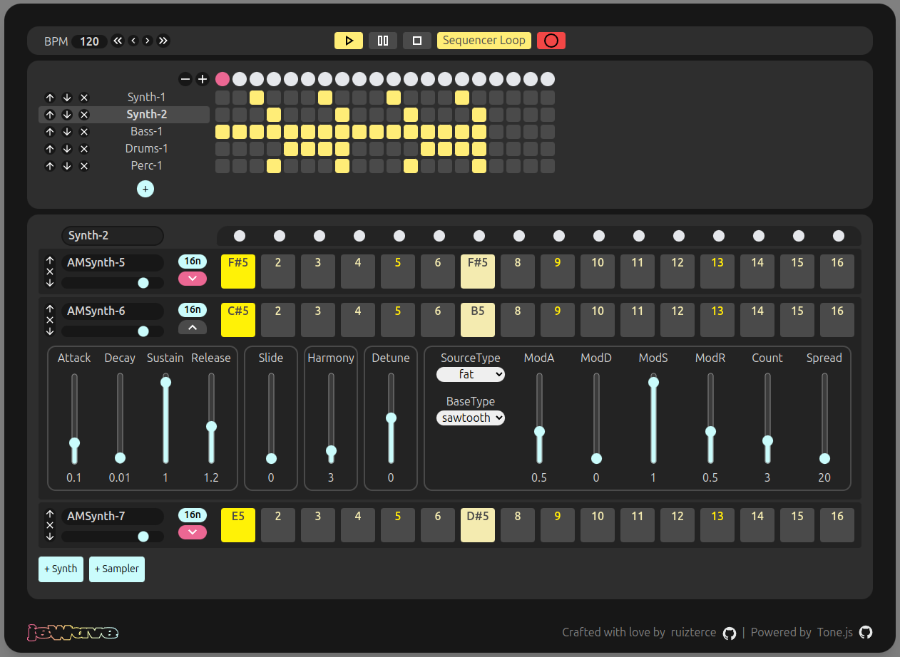
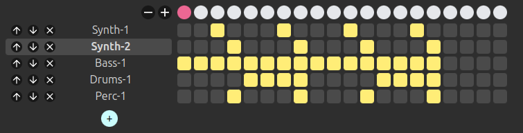
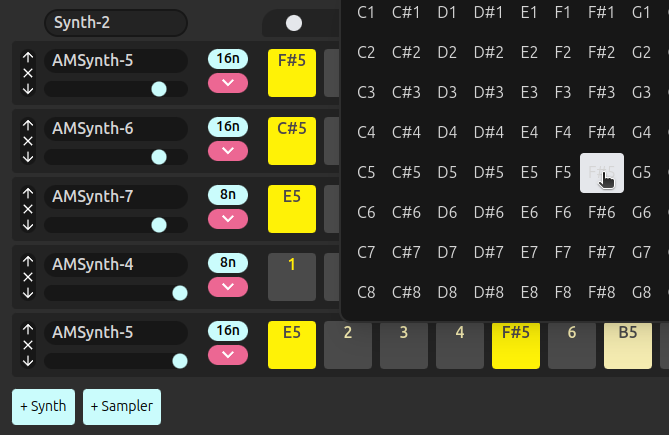
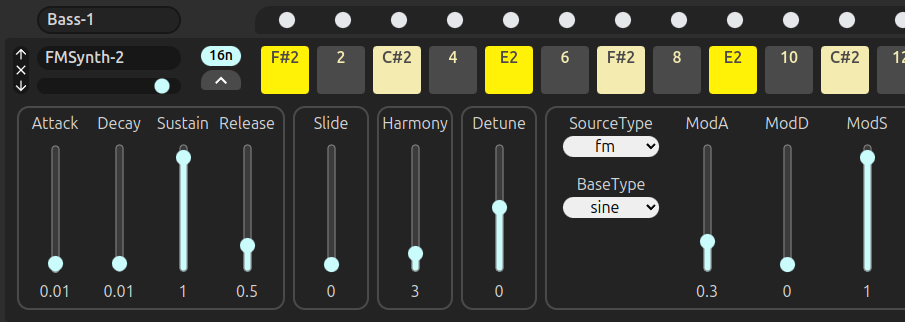
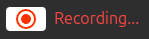

# jsWave



**jsWave** is a modern web-based music production tool inspired by legendary hardware such as the Roland TR-808, Akai MPC or E-mu SP-1200. Built with **[React](https://react.dev)**, **[Tone.js](https://github.com/Tonejs/Tone.js)**, JSWave offers a seamless interface for music producers to explore, compose, and create beats and melodies directly in their browser.

## Features

### 🎵 Music Production

- **Timeline View**: Visualize and organize your tracks with an intuitive block based timeline interface.
- **Sequencer**: Step-based sequencing for creating beats and loops in a familiar 16n pattern.
- **BPM Control**: Adjust tempo dynamically to fit your groove.
- **Play with the instruments**: Includes different types of synths with several parameters to tweak.

### 🎚️ Advanced Controls

- **Audio Recording**: Record and export your tracks for further production.
- **Loop Toggle**: Enable or disable looping for the sequence.
- **Dynamic Blocks**: Add and edit blocks in the timeline for complex arrangements.

### 🛠️ Built with Modern Tools

- **Tone.js**: Powering the audio engine with robust sound synthesis and sequencing.
- **React**: For a responsive, component-based architecture.
- **Tailwind CSS**: For a clean and highly customizable design system.

## Usage

- Open the app in your browser.
- Use the Transport Controls to play, pause, stop, or loop your sequence.

  

- Create sequencers and add blocks to the timeline.

  

- Add tracks to each sequencer and start laying out notes to craft your track. TIP: Rigth click to select a specific note.

  

- Tweak the parameters of the instruments to create your distinct sound.

  

- Export your creation as an audio file using the record and download feature.

  

## Local installation

To get started, clone the repository and install dependencies:

```bash
git clone https://github.com/ruizterce/jsWave.git
cd jsWave
npm install
```

Run the development server with the following command:

```bash
npm run dev
```

## Credits

Crafted with ❤️ by [ruizterce](https://github.com/ruizterce).

Powered by:

- [React](https://react.dev)
- [Tone.js](https://github.com/Tonejs/Tone.js)
- [Tailwind CSS](https://tailwindcss.com/)

Thanks to [Music Machines](http://machines.hyperreal.org/) for the classic drum machine samples.

Special thanks to the open-source community for providing the tools to build this project.

## License

License
This project is licensed under the [MIT License](https://opensource.org/license/MIT).
